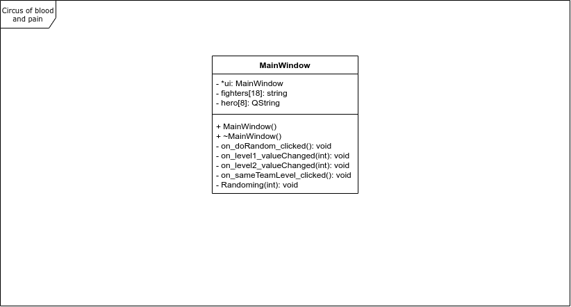
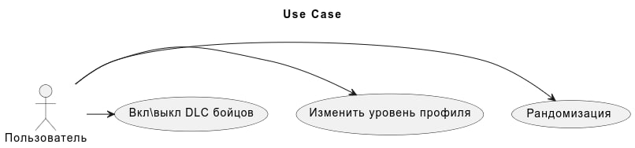
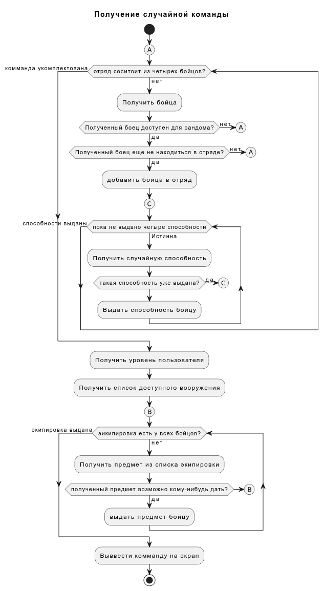
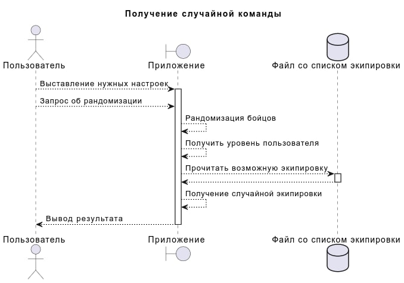
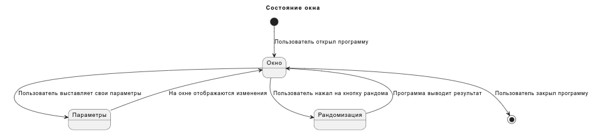

# Объектно-ориентированное проектирование системы

Язык программировния С++17

Фреймоврк Qt 6.4.0

## 1 Построение модельной предметной области в виде диаграммы классов

Диаграмму классов можно увидеть ниже

## 2 Проектирование Use case

Диаграмму use case можно увидеть ниже

## 3 Поток событий (flow control)

### 3.1 Краткое описание:

Позволяет получить случайную команду

### 3.2 Предусловия:

Как таковых нет.

### 3.3 Основной поток событий

 1. Пользователь запускает программу
 2. При необходимости выставляет нужные параметры
    * Включить \ выключить выпадение платных бойцов. Для этого используются чек-боксы. Ошибка невозможна
    * Одинаковый кровень для двух комманд. При изменении уровня одной команды выставляется точно такой же для другой, настройка происходит за счет чек-бокса, ошибка невозможна.
    * Изменение уровня команды. Поле с целочистленым значением. Не принимает для ввода символы отличные от цифр и не может быть ниже 0 или выше 75-ти.
 3. Пользователь нажимает на кнопку рандомизации.
 4. Программа разыгрывает случайные значения для бойцов
 5. Программа разыгрывает случайные значения для способностей бойцов
 6. Программа анализирует уровень игрока и получает список доступной экипировки
 7. Программа разыгрывает случайные значения для экипировки
 8. Программа выводит результат полученной комманды

### 3.4 Постусловия

Как таковых нет.

## 4 Диаграмма активности

Диаграмму активности можно увидеть ниже

## 5  Диаграммы последовательности

Диаграмму последовательности можно увидеть ниже

## 6 Диаграмма состояния

Диаграмму состояния можно увидеть ниже

На данной схеме можно увидеть объект "Файл со списком экипировки", данный файл будет предоставлен в виде тектового файла, содержащий названия всех мозвожных экипировок, разделённый на уровни и уточнённый классовыми ограничениями.

Мокап, показывающий результат рандомизации команды, можно увидеть ниже

В окне можно увидеть отображение выпавших бойцов и место расположения их вооружения.

## 7 Диаграмма компонентов

Так как приложение не имеет дополнительных компонентов, диаграмма компонентов является излишней.

## 8 Диаграмма развертывания

Так как приложение является одиночным файлом, диаграмма развертывания является излишней.
