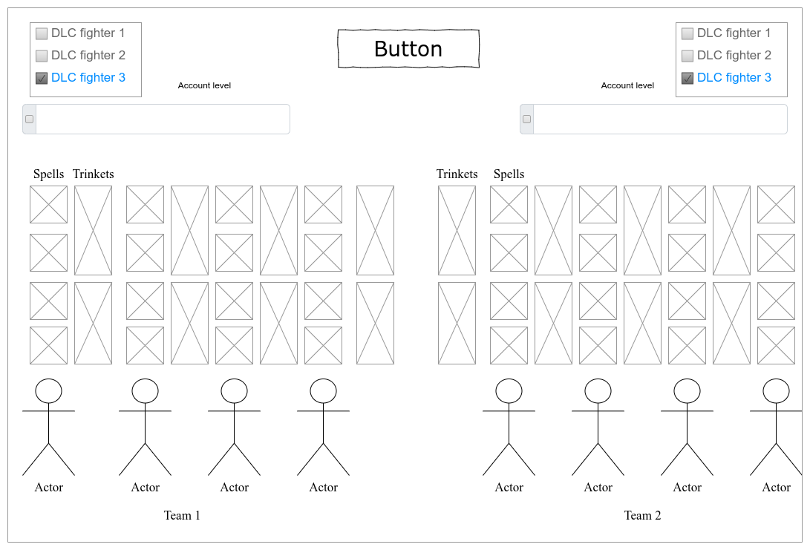

# Требования к проекту

## Введение

### 1.1 Назначение

В этом документе описаны функциональные и нефункциональные требования к приложению "Circus of blood and pain". Этот документ предназначен для команды, которая будет реализовывать и проверять корректность работы приложения.

### 1.2 Бизнес требования

#### 1.2.1 Исходные данные

19 января 2016 года вышла игра [Darkest Dungeon](https://www.darkestdungeon.com/), которая была очень тепло принята геймерами. Игра, в много известной площадке [Steam](https://store.steampowered.com/app/262060/Darkest_Dungeon/), получила более 100 тысяч положительных отзыв. Через время выходит бесплатное дополнение под названием "[Butcher Circus](https://store.steampowered.com/app/1117860/Darkest_Dungeon_The_Butchers_Circus/)", которое позволяет игрокам соревноваться мастерством управления своим отрядом. В связи с этим, в игру начали возвращаться люди, которые её прошли и новички которые только изучают игру, начали испытывать новый режим. Со временем на арене начали появляться очень "сыгранные" игроки, которые не давали шанса новичкам и держали топовые позиции до конца каждых лиг.

#### 1.2.2 Возможности бизнеса

Чтобы уравнять шансы между заядлыми игроками и людьми которые уделят в разы меньше времени данной игре и при этом не убрать интерес сражения есть возможность создать "рандомайзер" (случайное выпадение) для команд игроков. Такая возможность исключает выпадение "метовой" команды и добавляет часть веселья в уже привычные PVP (игрок против игрока) бои.

#### 1.2.3 Границы проекта

"Circus of blood and pain" будет выступать диллером для игроков, который выдает двум игрокам комманды.

### 1.3 Аналоги

Конкретно для данной игры аналогов нет.

---

## 2 Требования пользователя

### 2.1 Интерфейс пользователя

окно проведения рандома

### 2.2 Характеристики пользователей

#### 2.2.1 Классификация пользователей

Пользователь скачавший программу получает полный функционал.

#### 2.2.2 Целевая аудитория

Ветераны и новички игры Darkest Dungeon или другие геймеры, решившие сыграть в PVP режим.

### 2.3 Предположения и зависимости

Программа должна быть доступна на Linux и Windows.

---

## 3 Системные требования

### 3.1 Функциональный требования

#### 3.1.1 Приложение от лица пользователя

При открытии программы пользователь может выбрать уровень своего (и противника) аккаунта, выбрать какие платные персонажи ему (им) доступны и получить итоговую комманду для битвы.

### 3.2 Нефункциональные требования

#### 3.2.1 Визуальный стиль

Визуальный стиль приложения должен быть максимально приближен к атмосфере игры Darkest Dungeon, возможны свои доработки\добавления.

#### 3.2.3 Ограничения

1. Язык программирования c++17
2. Ui пишется в qt версии 6.4.0
3. Язык программы английский, так же предоставить возможность добавить другие языки.
