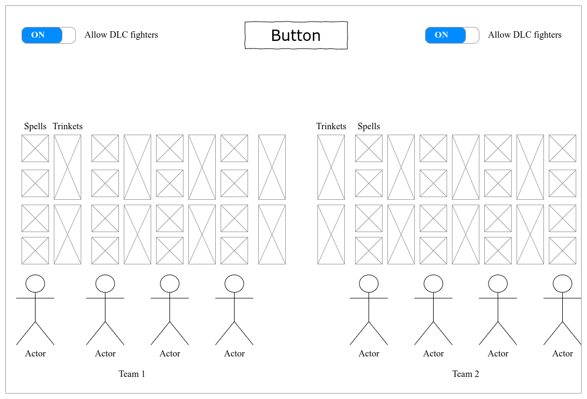
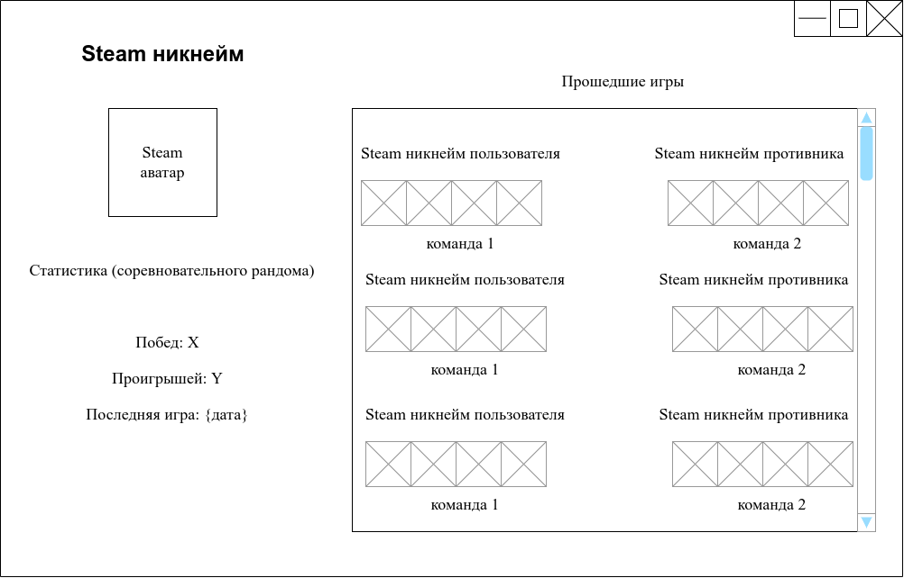
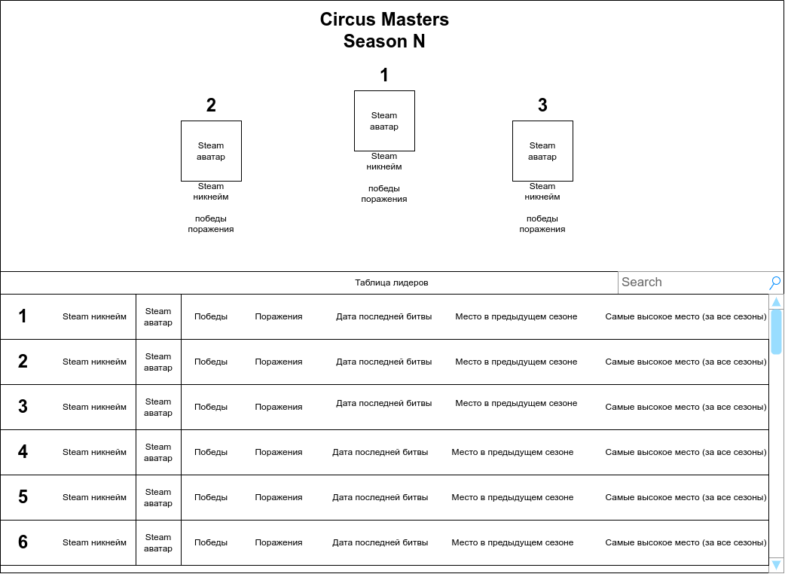
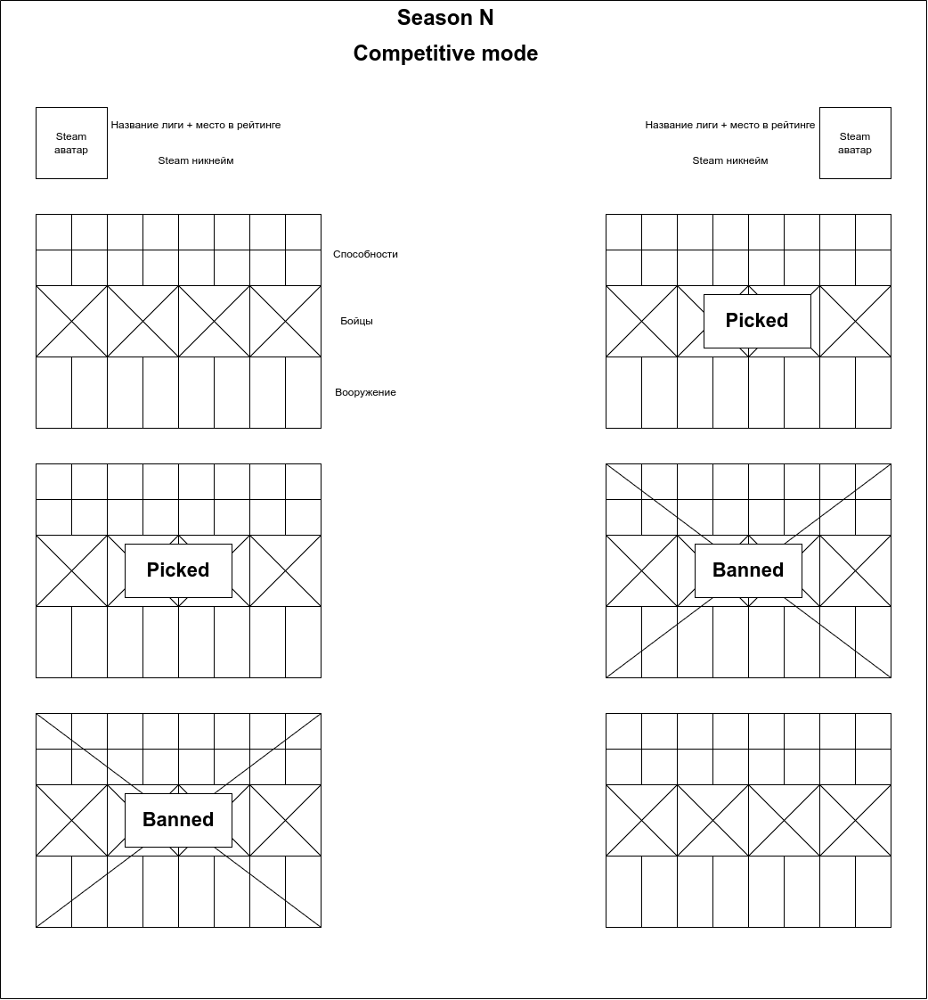
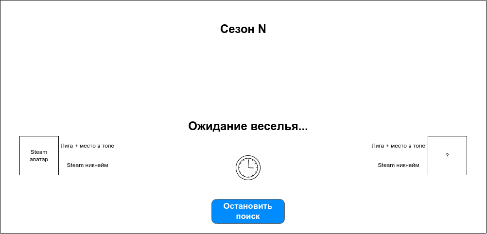

# Требования к проекту

## Введение

### 1.1 Назначение

В этом документе описаны функциональные и нефункциональные требования к приложению "Circus of blood and pain". Этот документ предназначен для команды, которая будет реализовывать и проверять корректность работы приложения.

### 1.2 Бизнес требования

#### 1.2.1 Исходные данные

19 января 2016 года вышла игра [Darkest Dungeon](https://www.darkestdungeon.com/) которая была очень тепло принята геймерами. Игра, в много известной площадке [Steam](https://store.steampowered.com/app/262060/Darkest_Dungeon/), получила более 100 тысяч положительных отзыв. Через время выходит бесплатное дополнение под названием "[Butcher Circus](https://store.steampowered.com/app/1117860/Darkest_Dungeon_The_Butchers_Circus/)", которое позволяет игрокам соревноваться мастерством управления своим отрядом. В связи с этим, в игру начали возвращаться люди которые её прошли и новички которые только изучают игру, начали испытывать новый режим. Со временем на арене начали появляться очень "сыгранные" игроки которые не давали шанса новичкам и держали топовые позиции до конца каждых лиг.

#### 1.2.2 Возможности бизнеса

Чтобы уравнять шансы между заядлыми игроками и людьми которые уделят в разы меньше времени данной игре и при этом не убрать интерес сражения есть возможность создать "рандомайзер" (случайное выпадение) для команд игроков. Такая возможность исключает выпадение "метовой" команды и добавляет часть веселье в уже привычные PVP (игрок против игрока) бои.

#### 1.2.3 Границы проекта

"Circus of blood and pain" будет выступать подрядчиком, которые организовывает бои между игроками. Программа будет бесплатная с платными функциями. Пользователю необязательно регистрироваться, но предпочтительнее будет иметь аккаунт. 

Для не зарегистрированных пользователей будет доступен обычный рандом, где случайном образом выбираются 4 бойца, случайным образом выбираются их способности и так же выбирается их вооружение.

Зарегистрированным пользователем будет доступна их статистика, просмотр своего профиля, возможность вызвать противника на бой, соревновательный режим битв и лига боевого рандома.

### 1.3 Аналоги

Известным аналогом, ориентирующийся на соревновательные игры, является [faceit](https://www.faceit.com/), где люди могут сразится с другими игроками в большом списке доступных кибердисциплин. Свою популярность данное приложение получило за счет таких игр как CS:GO и DOTA2

---

## 2 Требования пользователя

### 2.1 Интерфейс пользователя

окно проведения рандома

окно статистики пользователя

окно топа пользователей

окно соревновательного рандома

окно поиска противника

### 2.2 Характеристики пользователей

#### 2.2.1 Классификация пользователей

**Не зарегистрированные** пользователи - пользователи не создавшие аккаунт, они имеют доступ только к базовому рандому который позволяет выдать команду себе и противнику для лично договоренных матчей, так же подходит для тестирования приложения.

**Зарегистрированные пользователи** - пользователи связавшие свой Steam аккаунт к приложению. Такие пользователи имеют доступ к своему профилю, где отображается их личная статистика, появляется возможность бросать вызов других игрокам и открывается доступ к битвам соревновательного рандома. Так же пользователь может участвовать в турнирах которые могут организовываться другими энтузиастами.

#### 2.2.2 Целевая аудитория

Ветераны и новички игры Darkest Dungeon или другие геймеры, решившие сыграть в PVP режим.

### 2.3 Предположения и зависимости

1. Программа должна быть кроссплатформенной, так как и игра Darkest Dungeon доступна с разных систем.

2. Должна быть поддержка Oauth2 с платформой Steam для сбора некоторых данных о пользователе (прим никнейм)

3. Должна быть хорошая защита по отношению проверки на подписку к платным услугам.

---

## 3 Системные требования

### 3.1 Функциональный требования

#### 3.1.1 Приложение от лица не зарегистрированного пользователя

 * Пользователь при входе в программу получает уведомление о том, что не имеет аккаунта 
 * Если пользователь не решается создать аккаунт, то ему открывается окно базового рандома где он может протестировать функцию рандома или создать аккаунт

#### 3.1.2 Приложение от лица зарегистрированного пользователя

 * Пользователей так же обладает всем функционалом которые доступен для не зарегистрированного пользователя.
 * При входе пользователю открывается окно с его профилем с доступными вкладками: топ игроков, арена, лига, базовый рандом
 * Топ игроков открывает окно где отображаются чемпионы за всё время и лидеры в текущем сезоне, так же пользователь может увидеть свое место в мировом рейтинге
 * Арена открывает возможность найти случайного противника или, с помощью поиска, найти конкретного противника и бросить ему вызов. В арене есть платная подписка которая позволяет получить приоритет в поиске противника.
 * Лига позволяет принять участие в соревновательном рандоме, где двум игрокам выпадает 3 команды, каждый из игроков блокируют одну команду противника и выбирает для себя оставшуюся команду для сражения. Для лиги так же доступен платный приоритетный поиск.
 * базовый рандом просто выдает случайную команду пользователю.

#### 3.1.3 Система подбора противников

Каждый месяц объявляется новый игровой сезон при котором глобальный топ обнуляется, но при этом личная статистика пользователей не стирается. При сбросе глобальной статистики нужно учитывать очки "поощрения" в выдаче новой лиги. Лига - промежуточные уровни которые созданы для разделения более сильных игроков от более слабых, прим: Темнейшая - самые сильные игроки, Закаленные - средняя лига, Свежая кровь - начальная лига. В зависимости от очков поощрения зависит в какую именно лигу попадет игрок после завершения сезона, сделано это для того чтобы сильнейшие игроки не тратили время и не портили настроение другим игрокам побеждая их своим опытом сражений.

После нажатия пользователем на кнопку поиска, он попадает в окно поиска противника, если пользователь купил подписку приоритетного поиска, то он должен обладать особым приоритетом подбора игроков. Изначально подбираются игроки среди той же лиги в которой находится пользователь, спустя 30 секунд после поиска, поиск расширяется до нижней лиги (при условии если это не начальная лига), спустя еще 30 секунд поиск начинает работать по всем лигам. Если пользователь досрочно покидает игру, его приоритет поиска становится чуть ниже. Восстановить приоритет можно путем отыгрывания полных игр (1 очко приоритета = 3 игры). Если пользователь с купленной подпиской на приоритетный поиск досрочно покидает 2 игры, то он получает предупреждении о возможном снятии приоритетного поиска, если после этого пользователь покидает еще одну игру, то приоритетный поиск снимается и доступ на покупку блокируется на неделю.

Работа приоритета поиска заключается в том, что в первую очередь противники должны подбираться для людей с особым приоритетом, во вторую с обычным и в третью с низким приоритетом. Во время поиска нужно уведомлять пользователя каким именно приоритетом поиска он обладает и причину (прим. Куплена подписка).

В случае если игрок использует обычный поиск (не соревновательный) то поиск идёт совершенно свободно (нашелся - начал играть).

#### 3.1.4 Античит (или система блокировок)

Пользователи находящиеся под [VAC банном](https://steamcommunity.com/sharedfiles/filedetails/?id=607854175) изначально имеют низкие приоритет поиска, но у них нет запрета на повышение приоритета своего поиска. Если пользователь подозревается в читерстве или в нарочном краше сервера в целях досрочный завершения игры без потери рейтинга, то такой пользователь может получить ограничение на поиск новых боев от пары дней вплоть до полной блокировки. Заблокированные пользователи в мировом топе получают статус *Blocked* с причиной в описании их профиля.

### 3.2 Нефункциональные требования

#### 3.2.1 Визуальный стиль

Визуальный стиль приложения должен быть максимально приближен к атмосфере игры Darkest Dungeon, возможны свои доработки\добавления.

#### 3.2.2 Требования к удобству

Глобальная статистика должна обновляться каждые 20 минут или если пользователь завершил матч с противником.

#### 3.2.3 Ограничения

1. Язык программирования c++17
2. Ui пишется в qt версии 6.0.3
3. База данных PostgreSQL